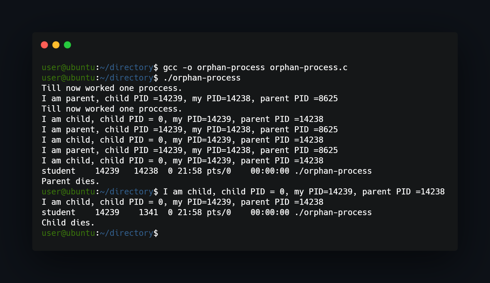

## What project do?
___
This project uses fork function to divide itself to parent-child mode and finally create child orphan process. Program displays ancestors PID and descendatns PID.



## How to use?
___
To compile and run program use gcc compiler or any other:
```
gcc -o orphan-process orphan-process.c
./orphan-process
```

<!--https://banner.godori.dev/ height:150-->
<!--https://shields.io/-->
<!--https://carbon.now.sh/-->
